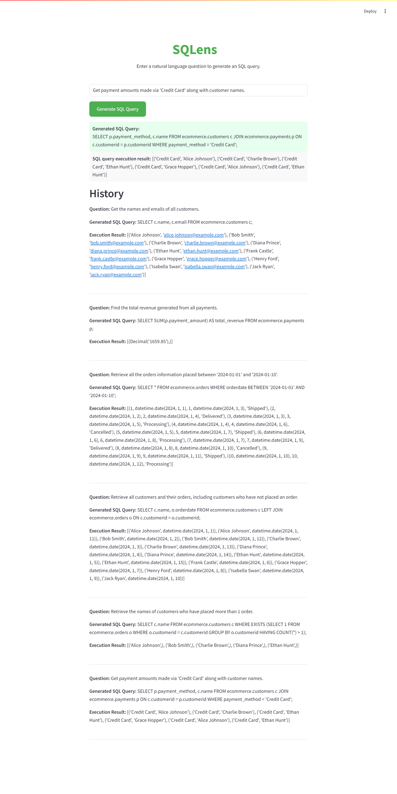

# <h1 align="center">SQLens: Natural Language to SQL Query Generator</h1>

**An web-based LLM-powered bot to convert natural language into executable SQL queries using the SQLCoder model — with syntax correction and live query execution.**

 

---

## Project Description

**SQLens** is an interactive web application built with **Streamlit** that allows users to query SQL databases using natural language. At its core, it runs the **locally hosted `sqlcoder-7b.Q5_K_M.gguf` model** via `llama-cpp-python`, enabling on-device inference for privacy and speed. This eliminates reliance on external APIs and ensures full control over data processing.

The system uses **LangChain** to manage prompt workflows and integrates **SQLGlot** for intelligent SQL parsing and formatting. Users can ask questions like “List all orders from the last 30 days,” and SQLens generates and runs the corresponding SQL query behind the scenes.

It supports connections to **MySQL** and any **SQLAlchemy-compatible** database, making it flexible and production-ready.

---

## Table of Contents
- [Project Title and Overview](#project-title-and-overview)
- [Project Description](#project-description)
- [Features](#features)
- [Technology Stack](#technology-stack)
- [Demo](#demo)
- [Installation](#installation)
- [Usage](#usage)
- [Configuration](#configuration)
- [Testing](#testing)
- [License](#license)
- [FAQs](#faqs)
- [Contact Information](#contact-information)

---

## Features

- 💡 **Natural Language to SQL Translation**: Generate SQL queries from plain English using the open-source **SQLCoder-7B** language model.

- 🧠 **Local Inference with llama-cpp-python**: Run the quantized `sqlcoder-7b.Q5_K_M.gguf` model locally using `llama-cpp-python` — no API keys or internet required.

- 🛠️ **Smart Syntax Correction**: Automatically fix invalid queries and provide live feedback with the help of SQLGlot.

- 🔄 **Real-Time Query Execution**: Execute generated queries directly on connected **MySQL** or **SQLAlchemy-compatible** databases and display results instantly.

- 📚 **Few-Shot Prompting with Examples**:  Enhance model accuracy using JSON-based examples for domain-specific customization.

- 🌐 **Streamlit-Based Web Interface**: A single-page app architecture built entirely with **Streamlit** — no need for separate backend or frontend code.

- 🗂️ **Session-Based Query History**: Keep track of all user-generated queries during the session for quick review or reuse.

---

## Technology Stack

### 💻 Frontend & Interface
- **Streamlit** – for building the interactive web UI

### 🧠 Backend & Inference
- **Python** – core language for backend logic
- **llama-cpp-python** – for local inference of the quantized SQLCoder model
- **LangChain** – manages prompt engineering and LLM interactions
- **SQLAlchemy**, **PyMySQL**, **mysql-connector-python** – for database connectivity and ORM support
- **SQLGlot** – handles SQL dialect translation and query validation

### 🗄️ Database Support
- **MySQL** (default)
- **PostgreSQL** *(easily extensible to other SQL databases)*

### 🛠️ Tools & Utilities
- **python-dotenv** – for secure and flexible environment variable configuration
- **Git & GitHub** – version control and project collaboration

### 🤖 LLM Model

- **Model**: `sqlcoder-7b.Q5_K_M.gguf`
- **Architecture**: 7B Parameter SQLCoder model
- **Inference Engine**: `llama-cpp-python`
- **Quantization Format**: GGUF (Q5_K_M)
- **Prompt Strategy**: Few-shot examples stored in `examples.json`
- **Context Window**: 4096 tokens

---

## Demo

Below are snapshots of the **SQLens** application showcasing its functionality in action — from entering a natural language question to viewing the generated SQL query and live database results.



---

## Installation

To set up SQLens locally:

1. **Clone the Repository**:

```bash
git clone https://github.com/ThakkarVidhi/llm-sql-bot.git
cd llm-sql-bot
```

2. **Install Dependencies**:

```bash
pip install -r requirements.txt
```

3. **Set Up Environment**:

Create a `.env` file and configure it as shown in the next section.

---

## Usage

1. **Run the Application**

To launch SQLens locally, simply execute:

```bash
streamlit run app.py
```

2. **Open in Browser**

Once the app is running, open your browser and go to:

```http://localhost:8501```

3. **Input a Natural Language Query**

Type a plain English question into the input field. 

```bash
Example: "Show all customers from New York who ordered in the past 6 months."
```

4. **Behind the Scenes**

The app will:

- Convert your natural language input into an SQL query using the SQLCoder-7B model.
- Execute the query on the connected database.
- Display the query results.
- Auto-correct any SQL syntax errors using SQLGlot if needed.

---

## Configuration

Before running SQLens, create a `.env` file in the project root and include the following configuration variables:

```env
# Database Configuration
DB_CONNECTION_STRING=mysql+pymysql://<username>:<password>@<host>/<dbname>
DB_NAME=<your_database_name>
DB_USER_NAME=<your_db_user>
DB_PASSWORD=<your_db_password>
DB_HOST=<your_db_host>
TABLES_NAME=customers,orders,payments

# Model Configuration
MODEL_PATH=./models/sqlcoder-7b.Q5_K_M.gguf

# Inference Parameters
TEMPERATURE=0.0
MAX_TOKENS=1024
TOP_P=1
N_CTX=4096

# SQL Dialects
TARGET_DIALECT=mysql
DEFAULT_DIALECT=postgres
```

### 🔐 Notes:
- Replace the values in `<angle brackets>` with your actual database and model configuration.
- Ensure the model path points to a valid `.gguf` file downloaded locally.
- Keep your `.env` file private — **do not push it to GitHub** or share it publicly.

---

## Testing

This project includes basic manual testing for functionality and usability.

To test the application:

1. Launch the app using Streamlit.
2. Open it in your browser at [http://localhost:8501](http://localhost:8501).
3. Try entering natural language queries such as:
   - `"List all orders placed last month."`
   - `"Show customers who made a payment over $1000."`
4. Observe:
   - Whether the generated SQL query is valid.
   - If the correct results are returned from the database.
   - How the app handles invalid or ambiguous queries (auto-correction, error messaging).

> ✅ Ensure the model is loaded, the database connection is successful, and queries execute as expected.

---

## License

This project is licensed under the [MIT License](LICENSE).  


---

## FAQs

**Q: What is SQLens?**  
**A:** SQLens is an AI-powered tool that converts natural language into SQL queries and executes them on a connected database.

**Q: Which databases are supported?**  
**A:** Currently, SQLens supports MySQL and any SQLAlchemy-compatible databases like PostgreSQL.

**Q: Is internet access required to run the model?**  
**A:** No. SQLens uses a locally hosted LLM (```SQLCoder-7B GGUF```) via `llama-cpp-python`, so no internet access is required after setup.

**Q: Can I add my own database or schema?**  
**A:** Yes. You can modify the `.env` configuration file to connect your own database and specify custom table names.

**Q: What happens if the model generates an invalid SQL query?**  
**A:** SQLens attempts to auto-correct invalid queries using SQLGlot and provides real-time feedback.

**Q: Is there any query history or logging?**  
**A:** Yes. SQLens maintains a session-based query history for reviewing previously executed queries.

---

## Contact Information

For questions or feedback, feel free to reach out:

- **Email**: [vidhithakkar.ca@gmail.com](mailto:vidhithakkar.ca@gmail.com)
- **LinkedIn**: [Vidhi Thakkar](https://www.linkedin.com/in/vidhi-thakkar-0b509724a/)